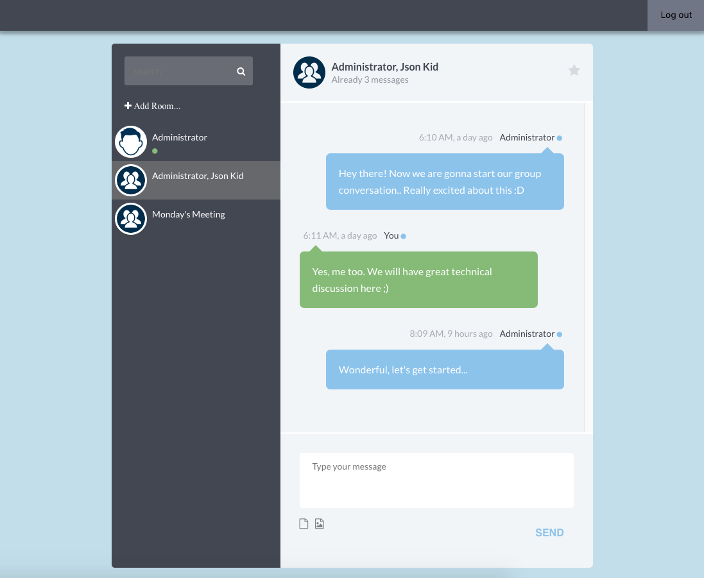
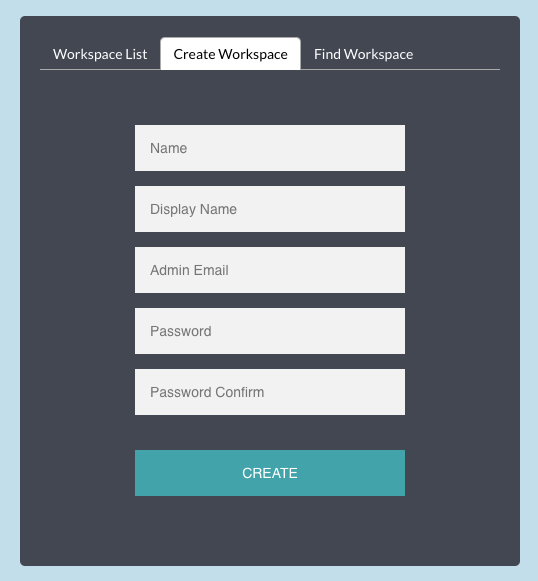
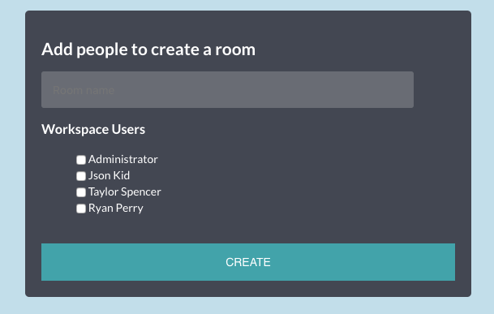

# React Chatting App
A chatting app which supports workspace, room feature





## Stack
- React/Redux
- Redux-Saga
- Socket.io

## Installation & Run
```bash
$ npm install
$ npm start
```

Note: this app uses https://github.com/meandevstar/node-mongo-chatting-api for backend

Here is the [Demo](https://rechatting.herokuapp.com)
